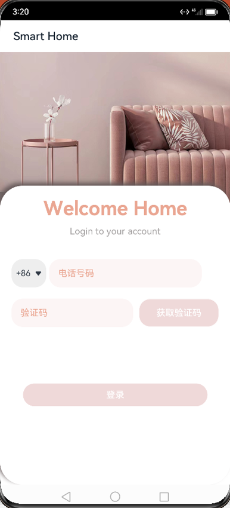
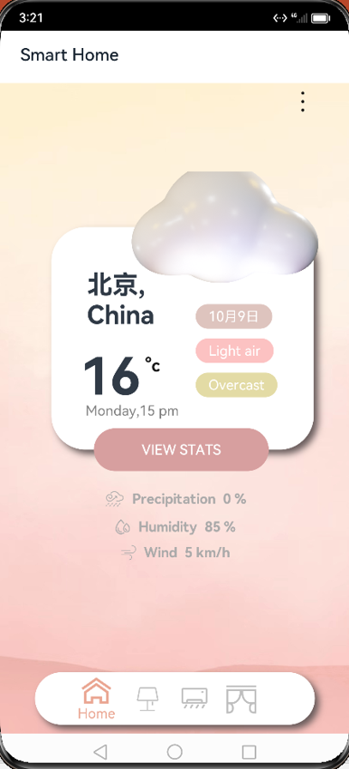
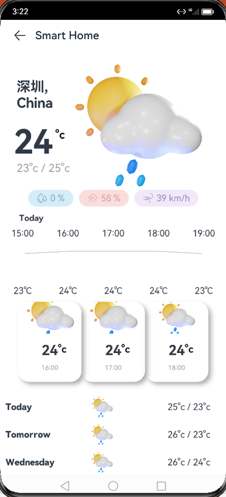

# A Smart Home App Based on HarmonyOS
## App Display
### Login with Phone Number
<!--  -->

### Weather
<!--  -->
<!--  -->

### Smart Lamp 
<!--  -->

### Smart Air-conditioner
<!--  -->

### Smart Curtain
<!--  -->

## Development
### Language 
- ArkUI, ArkTS
  - API type: stageMode
- Node.js
  - App services are developed based on [Huawei Serverless](https://developer.huawei.com/consumer/cn/agconnect/serverless). We use the Cloud Function and Cloud Database services provided by Huawei. 
### Simulation
- DevEco Studio
  - Compile SDK: HarmonyOS, 3.1.0 (API 9)
- Device:
  - resolution: 1228x2700px
  - size: 6.6"
  - version: 3.1.0.306
  - api: 9
  - arch: x86
  - RAM: 6 GB
  - ROM: 3 GB
  - #CPU: 4
  - Camera: emulated
  
## Code Contributors
> in alphabetical order
* Modi Cui
* Wancong Gao
* Song Tang
* Jialu Xu
* Wentong Zhang
